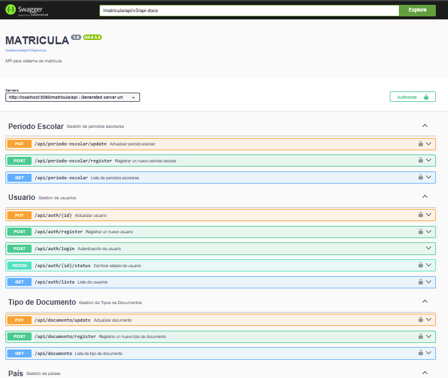
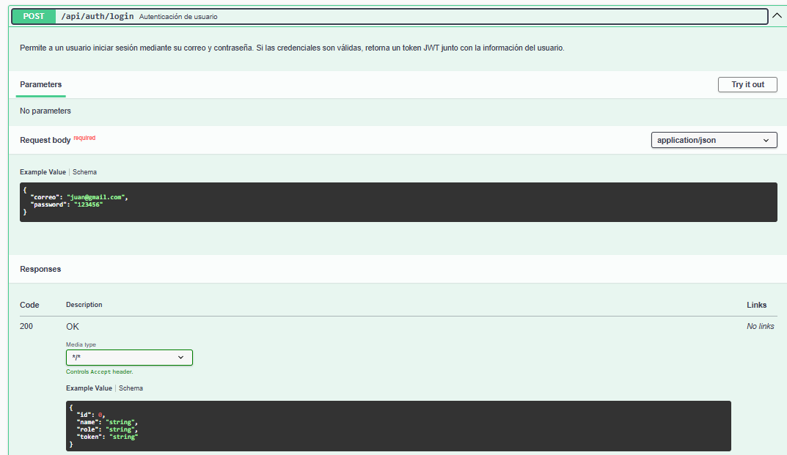
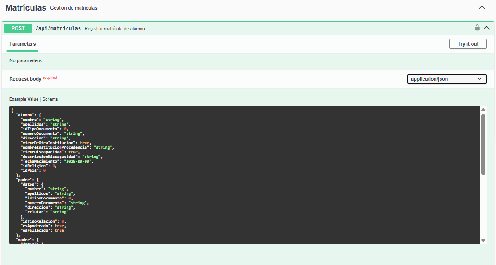
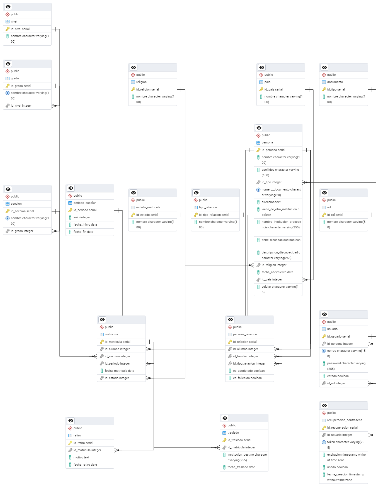

# 🎓 Sistema de Matrícula Escolar — Backend

API REST desarrollada con **Java y Spring Boot** para gestionar el proceso de matrícula escolar, usuarios, estudiantes, periodos académicos y catálogos administrativos.

Este proyecto forma parte de un sistema Full Stack compuesto por:

* 🖥️ **Frontend:** React + TypeScript + Vite
* ⚙️ **Backend:** Java + Spring Boot
* 🗄️ **Base de datos:** PostgreSQL

---

## 📋 Descripción

Backend de un sistema web orientado a la gestión de matrículas escolares.

La API permite administrar estudiantes, familiares, matrículas, usuarios, roles, periodos escolares y diferentes catálogos utilizados durante el proceso de inscripción.

El proyecto implementa autenticación mediante **JWT**, autorización basada en roles, manejo de excepciones, recuperación de contraseña mediante correo electrónico y documentación de la API mediante **Swagger/OpenAPI**.

---

## 🚀 Funcionalidades

### 🔐 Autenticación y seguridad

* Inicio de sesión mediante correo y contraseña.
* Autenticación basada en JWT.
* Protección de endpoints mediante Spring Security.
* Autorización basada en roles.
* Validación de tokens JWT.
* Manejo de accesos no autorizados.
* Recuperación de contraseña mediante correo electrónico.
* Tokens temporales para recuperación de contraseña.
* Cambio de contraseña.

### 🎓 Gestión de matrícula

* Registro de estudiantes.
* Gestión de información personal.
* Registro de familiares y relaciones familiares.
* Registro y gestión de matrículas.
* Consulta de información detallada del alumno.
* Consulta y filtrado de matrículas.
* Gestión de estados de matrícula.
* Generación de información para impresión de documentos de matrícula.

### 👥 Gestión de usuarios

* Registro de usuarios.
* Consulta de usuarios.
* Actualización de información.
* Activación y desactivación de usuarios.
* Gestión de roles.
* Filtrado y búsqueda de usuarios.

### 🏫 Gestión académica

* Niveles educativos.
* Grados.
* Secciones.
* Periodos escolares.

### ⚙️ Catálogos administrativos

* Países.
* Tipos de documento.
* Religiones.
* Roles.
* Estados.
* Tipos de relación familiar.

### 📄 API REST

* Endpoints organizados por módulos.
* DTOs para requests y responses.
* Paginación mediante respuestas personalizadas.
* Manejo global de excepciones.
* Respuestas HTTP estructuradas.
* Filtrado dinámico mediante Spring Data Specifications.

---

## 🛠️ Tecnologías utilizadas

| Tecnología        | Uso                      |
| ----------------- | ------------------------ |
| Java              | Lenguaje principal       |
| Spring Boot       | Framework backend        |
| Spring Security   | Seguridad y autorización |
| JWT               | Autenticación            |
| Spring Data JPA   | Persistencia             |
| Hibernate         | ORM                      |
| PostgreSQL        | Base de datos            |
| MapStruct         | Mapeo Entity ↔ DTO       |
| Spring Mail       | Envío de correos         |
| Swagger / OpenAPI | Documentación de API     |
| Gradle            | Gestión y construcción   |
| Docker            | Contenerización          |

---

## 🏗️ Arquitectura

El proyecto está organizado por responsabilidades:

```text
src/main/java/com/matricula
│
├── controller
│   └── Endpoints REST
│
├── dto
│   ├── academico
│   ├── matricula
│   ├── usuario
│   ├── documento
│   └── ...
│
├── entity
│   └── Entidades JPA
│
├── repository
│   └── Acceso a datos
│
├── service
│   ├── Interfaces
│   └── impl
│       └── Implementaciones
│
├── mapper
│   └── Mapeo Entity ↔ DTO
│
├── security
│   ├── JwtAuthFilter
│   ├── JwtUtil
│   ├── SecurityConfig
│   └── ...
│
├── exception
│   └── Manejo global de excepciones
│
├── specification
│   └── Filtros dinámicos
│
└── util
    └── Constantes y utilidades
```

### Flujo de la aplicación

```text
Cliente
   │
   ▼
Controller
   │
   ▼
Service
   │
   ▼
Repository
   │
   ▼
PostgreSQL
```

Para la transformación de datos:

```text
Entity
   │
   ▼
MapStruct
   │
   ▼
DTO
   │
   ▼
JSON Response
```

---

## 🔒 Seguridad

La API utiliza **Spring Security y JWT** para proteger los recursos.

Flujo de autenticación:

```text
Login
  │
  ▼
Spring Security
  │
  ▼
Validación de credenciales
  │
  ▼
Generación de JWT
  │
  ▼
Cliente
  │
  ▼
Authorization: Bearer <token>
  │
  ▼
JwtAuthFilter
  │
  ▼
Endpoint protegido
```

Los permisos de acceso se gestionan mediante roles.

---

## 📚 Documentación de la API

El proyecto utiliza **Swagger / OpenAPI** para documentar y probar los endpoints.

Con el backend ejecutándose localmente:

```text
http://localhost:8090/matricula/api/swagger-ui/index.html
```

El backend utiliza:

```properties
server.port=8090
server.servlet.context-path=/matricula/api
```

Por lo tanto, el contexto base de la API es:

```text
http://localhost:8090/matricula/api
```

> Swagger puede requerir autenticación según la configuración de seguridad del proyecto.

---

## 📸 Evidencias técnicas

### Swagger / OpenAPI



### 🔐 Autenticación JWT



### 🎓 API de Matrículas



### 🗄️ Diagrama de base de datos



---

## ⚙️ Configuración

Las credenciales y configuraciones sensibles se manejan mediante **variables de entorno**.

Variables utilizadas:

```env
DB_URL=jdbc:postgresql://localhost:5432/matricula
DB_USER=postgres
DB_PASSWORD=********

JWT_SECRET=********
JWT_EXPI=86400000

CORREO=********
PASW_APLI=********

CORS_ALLOWED_ORIGINS=http://localhost:5173

SW_USER=********
SW_PASSWORD=********
```

> No se deben almacenar credenciales reales directamente en el repositorio.

---

## ▶️ Ejecución local

### 1. Clonar el repositorio

```bash
git clone <URL_DEL_REPOSITORIO>
cd matricula-backend
```

### 2. Configurar variables de entorno

Configurar las siguientes variables:

```text
DB_URL
DB_USER
DB_PASSWORD
JWT_SECRET
JWT_EXPI
CORREO
PASW_APLI
CORS_ALLOWED_ORIGINS
SW_USER
SW_PASSWORD
```

### 3. Ejecutar con Gradle

Windows:

```bash
.\gradlew.bat bootRun
```

Linux/macOS:

```bash
./gradlew bootRun
```

### 4. Acceder a la API

```text
http://localhost:8090/matricula/api
```

### 5. Acceder a Swagger

```text
http://localhost:8090/matricula/api/swagger-ui/index.html
```

---

## 🐳 Ejecución con Docker

El proyecto incluye un `Dockerfile` para ejecutar el backend mediante Docker.

Construir la imagen:

```bash
docker build -t matricula-backend .
```

Ejecutar el contenedor:

```bash
docker run -p 8090:8090 matricula-backend
```

Las variables de entorno deben configurarse al ejecutar el contenedor.

---

## 🔗 Integración con Frontend

El backend expone una API REST consumida por el frontend desarrollado con React y TypeScript.

```text
┌─────────────────────────────┐
│       React + TypeScript    │
│            Vite             │
└──────────────┬──────────────┘
               │
               │ HTTP / JSON
               │ JWT
               ▼
┌─────────────────────────────┐
│       Spring Boot API       │
│                             │
│ Controllers                 │
│ Services                    │
│ Repositories                │
│ Spring Security + JWT       │
└──────────────┬──────────────┘
               │
               ▼
┌─────────────────────────────┐
│         PostgreSQL          │
└─────────────────────────────┘
```

---

## 📌 Principales módulos

```text
/api/auth
/api/matriculas
/api/usuarios
/api/roles
/api/documentos
/api/paises
/api/religiones
/api/periodos-escolares
/api/estados
/api/academico
/api/tokens
```

> Los endpoints, parámetros y modelos disponibles pueden consultarse desde Swagger/OpenAPI.

---

## 📂 Proyecto relacionado

### Frontend

Aplicación web desarrollada con React y TypeScript para consumir esta API.

**Repositorio:** `MatriculaFrontend`

El sistema completo está compuesto por:

```text
Matricula
│
├── matricula-backend
│   └── Java + Spring Boot + PostgreSQL
│
└── matricula-frontend
    └── React + TypeScript + Vite
```

---

## 👨‍💻 Autor

**Gino Anderson Moreno Bejarano**

Desarrollador Full Stack Junior

* LinkedIn: linkedin.com/in/ginomorenobejarano
* GitHub: github.com/GinoAMB
* Email: [gino.anderson2011@gmail.com](mailto:gino.anderson2011@gmail.com)

